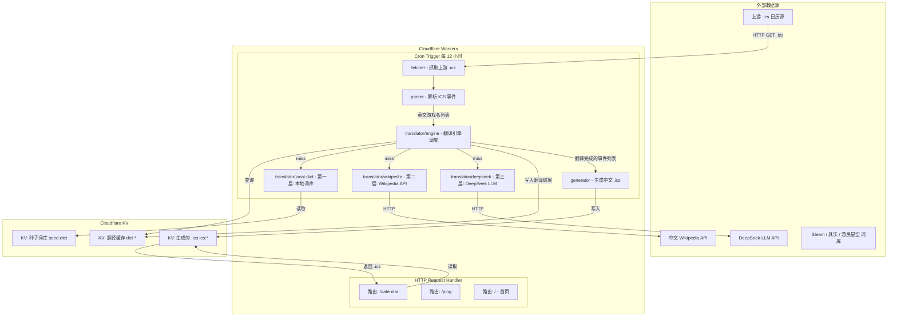
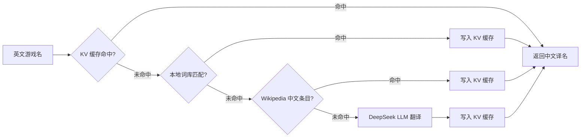

# 中文游戏发售日历服务 — 架构设计文档

> 项目代号：`ical-videogames-zh`
> 目标平台：Cloudflare Workers
> 语言：TypeScript
> 基于 [ical-videogames](https://github.com/ical-videogames) 开源项目理念

---

## 1. 系统架构总览

### 1.1 核心设计理念

与原项目（Python/Flask，请求时实时生成 .ics）不同，本项目采用**预生成 + 缓存分发**模式：

- **Cron 定时任务**负责：抓取上游数据 → 翻译 → 生成 .ics → 存入 KV
- **HTTP 请求处理**负责：从 KV 读取预生成的 .ics → 返回给用户

这种设计将翻译的耗时操作（尤其是 LLM API 调用）与用户请求完全解耦，确保用户订阅日历时获得毫秒级响应。

### 1.2 系统架构图（Mermaid）



### 1.3 数据流详解

```
┌─────────────────────────────────────────────────────────────┐
│                    Cron Trigger (每 12h)                      │
│                                                              │
│  1. fetcher: GET 上游 .ics URL 列表                           │
│     ↓                                                        │
│  2. parser: 解析 .ics → CalendarEvent[]                      │
│     { uid, title, date, platform }                           │
│     ↓                                                        │
│  3. 去重: 提取唯一英文游戏名 Set<string>                       │
│     ↓                                                        │
│  4. translator/engine: 批量翻译                               │
│     对每个游戏名:                                              │
│     ├─ 查 KV dict:{name} → 命中? 直接使用                     │
│     ├─ Layer 1: 本地词库精确匹配 → 命中? 写 KV, 使用           │
│     ├─ Layer 2: Wikipedia zh API 查询 → 命中? 写 KV, 使用     │
│     └─ Layer 3: DeepSeek API 翻译 → 写 KV, 使用               │
│     ↓                                                        │
│  5. generator: 组装中文 .ics 文件                             │
│     Event: [中文名] English Name                              │
│     ↓                                                        │
│  6. 写入 KV ics:{platform} 和 ics:all                         │
└─────────────────────────────────────────────────────────────┘

┌─────────────────────────────────────────────────────────────┐
│                    HTTP Request                              │
│                                                              │
│  GET /calendar?platform=ps5&platform=switch                  │
│     ↓                                                        │
│  从 KV 读取 ics:{platform} → 合并 → 返回 .ics                 │
│  GET /calendar (无参数) → 返回 ics:all                        │
└─────────────────────────────────────────────────────────────┘
```

---

## 2. Cloudflare Workers 项目结构

```
ical-videogames/
├── wrangler.toml                    # Cloudflare Workers 配置
├── package.json                     # 依赖与脚本
├── tsconfig.json                    # TypeScript 配置
├── .dev.vars                        # 本地开发环境变量（API Key 等）
│
├── src/
│   ├── index.ts                     # Worker 入口：fetch + scheduled handler
│   ├── types.ts                     # 全局类型定义
│   ├── config.ts                    # 常量配置（上游 URL、平台映射等）
│   ├── env.ts                       # 环境变量类型声明
│   │
│   ├── calendar/
│   │   ├── fetcher.ts               # 抓取上游 .ics 文件
│   │   ├── parser.ts                # 解析 .ics 内容为结构化事件
│   │   ├── generator.ts             # 将翻译后的事件生成 .ics 字符串
│   │   └── sources.ts               # 上游 .ics 源 URL 配置与管理
│   │
│   ├── translator/
│   │   ├── engine.ts                # 翻译引擎调度器（串联三层翻译）
│   │   ├── local-dict.ts            # 第一层：本地高频词库匹配
│   │   ├── wikipedia.ts             # 第二层：Wikipedia API 中文条目查询
│   │   ├── deepseek.ts              # 第三层：DeepSeek LLM 翻译
│   │   └── cache.ts                 # 翻译缓存 KV 读写封装
│   │
│   ├── tasks/
│   │   └── update-calendar.ts       # Cron 定时任务主逻辑
│   │
│   └── routes/
│       ├── calendar.ts              # /calendar 路由处理
│       ├── index.ts                 # / 首页路由
│       └── ping.ts                  # /ping 健康检查
│
├── data/
│   └── seed-dict.json               # 种子词库（部署时导入 KV）
│
├── test/
│   ├── translator/
│   │   ├── engine.test.ts
│   │   ├── local-dict.test.ts
│   │   ├── wikipedia.test.ts
│   │   └── deepseek.test.ts
│   ├── calendar/
│   │   ├── parser.test.ts
│   │   └── generator.test.ts
│   └── tasks/
│       └── update-calendar.test.ts
│
└── docs/
    └── architecture.md              # 本文档
```

### 2.1 模块职责说明

| 模块 | 文件 | 职责 |
|------|------|------|
| **入口** | [`index.ts`](src/index.ts) | Worker 入口，注册 HTTP `fetch` 和 Cron `scheduled` handler |
| **类型** | [`types.ts`](src/types.ts) | 定义 [`CalendarEvent`](src/types.ts)、[`TranslationResult`](src/types.ts)、[`GameEntry`](src/types.ts) 等核心类型 |
| **配置** | [`config.ts`](src/config.ts) | 上游 .ics URL 列表、平台枚举与映射、Cron 表达式等 |
| **环境** | [`env.ts`](src/env.ts) | Cloudflare 环境变量类型声明（KV namespace、Secrets 等） |
| **抓取器** | [`calendar/fetcher.ts`](src/calendar/fetcher.ts) | 并发抓取上游 .ics 文件，处理超时与错误 |
| **解析器** | [`calendar/parser.ts`](src/calendar/parser.ts) | 将 .ics 文本解析为 [`CalendarEvent[]`](src/types.ts) |
| **生成器** | [`calendar/generator.ts`](src/calendar/generator.ts) | 将翻译后的事件列表生成标准 .ics 文本 |
| **数据源** | [`calendar/sources.ts`](src/calendar/sources.ts) | 管理上游 .ics 源 URL 配置，支持按平台分组 |
| **翻译引擎** | [`translator/engine.ts`](src/translator/engine.ts) | 编排三层翻译：缓存 → 本地词库 → Wikipedia → DeepSeek |
| **本地词库** | [`translator/local-dict.ts`](src/translator/local-dict.ts) | 加载并查询本地种子词库，支持精确匹配和模糊匹配 |
| **Wikipedia** | [`translator/wikipedia.ts`](src/translator/wikipedia.ts) | 调用中文 Wikipedia API 查询游戏条目标题 |
| **DeepSeek** | [`translator/deepseek.ts`](src/translator/deepseek.ts) | 调用 DeepSeek API 进行智能翻译 |
| **缓存** | [`translator/cache.ts`](src/translator/cache.ts) | 封装 KV 读写操作，提供翻译缓存的 get/set/batch |
| **定时任务** | [`tasks/update-calendar.ts`](src/tasks/update-calendar.ts) | Cron 触发的主编排流程 |
| **路由** | [`routes/calendar.ts`](src/routes/calendar.ts) | 处理 `/calendar` 请求，支持 platform/region 参数过滤 |

---

## 3. 翻译引擎设计

### 3.1 三层翻译策略

翻译按优先级依次尝试，命中即停止（短路逻辑）：



### 3.2 第一层：本地高频词库

#### 数据结构

```typescript
// data/seed-dict.json
interface SeedDictionary {
  version: string;                    // 词库版本号，如 "2024.06"
  updatedAt: string;                  // ISO 8601 更新时间
  entries: Record<string, string>;    // 英文名 → 中文名
  // 示例:
  // "The Legend of Zelda: Tears of the Kingdom": "塞尔达传说：王国之泪"
  // "Elden Ring": "艾尔登法环"
}
```

#### 数据来源与获取方式

| 来源 | 获取方式 | 数据量 | 更新频率 |
|------|----------|--------|----------|
| **Steam 商店** | Steam Store API（`appdetails`）获取中英文名对照 | 约 8 万+ | 每月增量更新 |
| **其乐 Keylol** | 社区维护的 Steam 中文名数据库（CSV/JSON） | 约 5 万+ | 跟随社区更新 |
| **游民星空** | 爬取游戏库页面的中英文名对照 | 约 3 万+ | 每月 |
| **VGTime 游戏时光** | 游戏数据库中英文对照 | 约 2 万+ | 每月 |
| **手动维护** | 高频/热门游戏人工补充 | 按需 | 按需 |

#### 构建流程

1. **离线构建脚本**（Node.js 脚本，非 Worker 内运行）：
   - 从 Steam API 批量拉取游戏列表及中文名
   - 合并其乐等社区数据源
   - 去重、清洗、生成 `seed-dict.json`
   - 使用 `wrangler kv:bulk put` 导入 Cloudflare KV

2. **KV 中的存储格式**：
   - 整个词库作为单个 KV 值存储：key = `seed:dict`，value = JSON 序列化的完整词库
   - 也可拆分为按首字母分片：`seed:dict:a`、`seed:dict:b` 等（减少单次读取大小）

#### 匹配策略

```typescript
// translator/local-dict.ts
async function lookupLocalDict(
  englishName: string,
  env: Env
): Promise<string | null> {
  // 1. 精确匹配
  const exact = dict.entries[englishName];
  if (exact) return exact;

  // 2. 大小写不敏感匹配
  const lower = englishName.toLowerCase();
  for (const [key, value] of Object.entries(dict.entries)) {
    if (key.toLowerCase() === lower) return value;
  }

  // 3. 去除副标题后匹配（如 "Game Name: Subtitle" → "Game Name"）
  const baseName = englishName.split(":")[0].trim();
  if (baseName !== englishName) {
    const baseResult = dict.entries[baseName];
    if (baseResult) return baseResult;
  }

  return null;
}
```

### 3.3 第二层：Wikipedia API 中文条目查询

#### API 调用方式

使用 MediaWiki API 的 `langlinks` 功能查询英文条目的中文标题：

```
GET https://en.wikipedia.org/w/api.php
  ?action=query
  &titles=Elden Ring
  &prop=langlinks
  &lllang=zh
  &format=json
```

#### 响应解析

```json
{
  "query": {
    "pages": {
      "12345": {
        "title": "Elden Ring",
        "langlinks": [
          { "lang": "zh", "*": "艾尔登法环" }
        ]
      }
    }
  }
}
```

#### 实现策略

```typescript
// translator/wikipedia.ts
async function lookupWikipedia(
  englishName: string
): Promise<string | null> {
  // 1. 查询英文 Wikipedia 的中文 langlink
  const url = new URL("https://en.wikipedia.org/w/api.php");
  url.searchParams.set("action", "query");
  url.searchParams.set("titles", englishName);
  url.searchParams.set("prop", "langlinks");
  url.searchParams.set("lllang", "zh");
  url.searchParams.set("format", "json");
  url.searchParams.set("redirects", "1");  // 自动跟随重定向

  const resp = await fetch(url.toString());
  const data = await resp.json();

  // 2. 提取中文标题
  const pages = data.query?.pages;
  if (!pages) return null;

  const page = Object.values(pages)[0] as any;
  const zhLink = page?.langlinks?.find((l: any) => l.lang === "zh");
  return zhLink?.["*"]?.replace(/ \(游戏\)$/, "") || null;
}
```

#### 优化措施

- **批量查询**：MediaWiki API 支持 `titles=Page1|Page2|Page3`（最多 50 个），减少请求数
- **User-Agent**：设置合规的 User-Agent 头，遵守 Wikipedia API 礼仪
- **错误处理**：404/429 等状态码的优雅降级
- **结果清洗**：去除中文标题中的消歧义后缀，如 `(游戏)`、`(电子游戏)` 等

### 3.4 第三层：DeepSeek LLM 智能翻译

#### API 集成

```typescript
// translator/deepseek.ts
async function translateWithDeepSeek(
  englishNames: string[]
): Promise<Map<string, string>> {
  const DEEPSEEK_API_KEY = env.DEEPSEEK_API_KEY;
  const DEEPSEEK_API_URL = "https://api.deepseek.com/chat/completions";

  const prompt = buildTranslationPrompt(englishNames);

  const resp = await fetch(DEEPSEEK_API_URL, {
    method: "POST",
    headers: {
      "Content-Type": "application/json",
      "Authorization": `Bearer ${DEEPSEEK_API_KEY}`,
    },
    body: JSON.stringify({
      model: "deepseek-chat",
      messages: [
        { role: "system", content: SYSTEM_PROMPT },
        { role: "user", content: prompt },
      ],
      temperature: 0.1,       // 低温度确保翻译一致性
      response_format: { type: "json_object" },
    }),
  });

  const data = await resp.json();
  return parseTranslationResponse(data);
}
```

#### Prompt 设计

**System Prompt**：

```
你是一个专业的电子游戏名称翻译专家。你的任务是将英文游戏名称翻译为中文。

规则：
1. 优先使用中国大陆玩家社区广泛接受的官方中文译名
2. 如果游戏有官方中文名，必须使用官方中文名
3. 如果没有官方中文名，使用中国大陆主流游戏媒体（如游民星空、3DM、游侠网）通用的译名
4. 保持专有名词的一致性（如 "Zelda" → "塞尔达"，"Mario" → "马里奥"）
5. 系列作品保持命名风格一致
6. 如果确实无法确定中文名，保留英文原名
7. 输出必须为严格的 JSON 格式
```

**User Prompt**：

```
请将以下英文游戏名称翻译为中文，返回 JSON 格式。

游戏列表：
1. The Legend of Zelda: Echoes of Wisdom
2. Metaphor: ReFantazio
3. S.T.A.L.K.E.R. 2: Heart of Chornobyl

请返回以下 JSON 格式：
{
  "translations": [
    {"en": "英文名", "zh": "中文名"}
  ]
}
```

#### 批量处理策略

- 每次请求最多发送 **20 个**游戏名（控制 token 消耗和响应时间）
- DeepSeek-chat 模型的上下文窗口足够大，20 个游戏名完全在范围内
- 使用 `response_format: { type: "json_object" }` 确保返回结构化 JSON
- 设置 `temperature: 0.1` 保证翻译一致性

### 3.5 翻译缓存策略

#### KV Key 设计

```
dict:{英文游戏名的 URL 编码} → 中文译名字符串
```

示例：
- `dict:Elden%20Ring` → `艾尔登法环`
- `dict:The%20Legend%20of%20Zelda%3A%20Tears%20of%20the%20Kingdom` → `塞尔达传说：王国之泪`

#### TTL 策略

| 缓存类型 | TTL | 理由 |
|----------|-----|------|
| 翻译缓存 | **30 天** | 游戏译名几乎不会变化，30 天足够 |
| 生成的 .ics | **14 小时** | 略大于 Cron 间隔（12h），确保不会过早过期 |
| 种子词库 | **无过期** | 手动更新，不需要自动过期 |

#### 缓存写入策略

```typescript
// translator/cache.ts
async function setTranslationCache(
  env: Env,
  englishName: string,
  chineseName: string
): Promise<void> {
  const key = `dict:${encodeURIComponent(englishName)}`;
  await env.TRANSLATION_KV.put(key, chineseName, {
    expirationTtl: 60 * 60 * 24 * 30,  // 30 天
  });
}

async function getTranslationCache(
  env: Env,
  englishName: string
): Promise<string | null> {
  const key = `dict:${encodeURIComponent(englishName)}`;
  return await env.TRANSLATION_KV.get(key);
}
```

#### 批量翻译优化流程

```typescript
// translator/engine.ts
async function batchTranslate(
  englishNames: string[],
  env: Env
): Promise<Map<string, string>> {
  const results = new Map<string, string>();
  const uncachedNames: string[] = [];

  // Step 1: 批量查缓存
  const cachePromises = englishNames.map(name =>
    getTranslationCache(env, name).then(value => ({ name, value }))
  );
  const cacheResults = await Promise.all(cachePromises);

  for (const { name, value } of cacheResults) {
    if (value) {
      results.set(name, value);
    } else {
      uncachedNames.push(name);
    }
  }

  if (uncachedNames.length === 0) return results;

  // Step 2: 本地词库
  const stillUncached: string[] = [];
  const dict = await loadSeedDict(env);

  for (const name of uncachedNames) {
    const localResult = lookupLocalDict(name, dict);
    if (localResult) {
      results.set(name, localResult);
      await setTranslationCache(env, name, localResult);
    } else {
      stillUncached.push(name);
    }
  }

  if (stillUncached.length === 0) return results;

  // Step 3: Wikipedia API（批量，每 50 个一组）
  const wikiRemaining: string[] = [];
  for (let i = 0; i < stillUncached.length; i += 50) {
    const batch = stillUncached.slice(i, i + 50);
    const wikiResults = await batchLookupWikipedia(batch);

    for (const [en, zh] of wikiResults) {
      if (zh) {
        results.set(en, zh);
        await setTranslationCache(env, en, zh);
      } else {
        wikiRemaining.push(en);
      }
    }
  }

  if (wikiRemaining.length === 0) return results;

  // Step 4: DeepSeek LLM（批量，每 20 个一组）
  for (let i = 0; i < wikiRemaining.length; i += 20) {
    const batch = wikiRemaining.slice(i, i + 20);
    const llmResults = await translateWithDeepSeek(batch, env);

    for (const [en, zh] of llmResults) {
      results.set(en, zh);
      await setTranslationCache(env, en, zh);
    }
  }

  return results;
}
```

---

## 4. ICS 处理设计

### 4.1 上游 .ics 源选择

由于原项目从 Wikipedia 抓取 HTML 表格获取游戏发售数据，而本项目需要 `.ics` 格式的上游源，有以下策略：

#### 策略 A：Wikipedia 数据自采集（推荐主方案）

在 Cloudflare Worker 的 Cron 任务中，直接通过 MediaWiki API 获取结构化数据，然后在内部构建事件对象。这种方式不依赖外部 .ics 源，可靠性最高。

```
MediaWiki API (en.wikipedia.org/w/api.php)
  → 获取游戏列表页面的结构化数据
  → 解析为 CalendarEvent 对象
  → 翻译后生成 .ics
```

Wikipedia API 页面列表（对应原项目的 wiki 页面）：

| 平台 | Wikipedia 页面标题 |
|------|-------------------|
| PS5 | `List_of_PlayStation_5_games` |
| PS4 | `List_of_PlayStation_4_games` |
| Nintendo Switch | `List_of_Nintendo_Switch_games` |
| Xbox One | `List_of_Xbox_One_games` |
| Xbox Series X/S | `List_of_Xbox_Series_X_and_Series_S_games` |
| Nintendo Switch 2 | `List_of_Nintendo_Switch_2_games` |

#### 策略 B：第三方 .ics 日历源（辅助方案）

作为补充数据源，支持配置外部 .ics URL：

| 潜在源 | URL 格式 | 说明 |
|--------|----------|------|
| IGDB 社区日历 | 可配置 | 社区维护的游戏发售日历 |
| 自建 Wikipedia 爬虫服务 | 可配置 | 独立部署的爬虫生成 .ics |
| 手动维护源 | 可配置 | 人工维护的 .ics 文件 |

#### 源配置结构

```typescript
// calendar/sources.ts
interface CalendarSource {
  id: string;              // 唯一标识
  name: string;            // 显示名称
  url: string;             // .ics 文件 URL
  platform: Platform;      // 关联平台
  enabled: boolean;        // 是否启用
  priority: number;        // 优先级（数字越小越高）
}

const DEFAULT_SOURCES: CalendarSource[] = [
  {
    id: "wikipedia-ps5",
    name: "Wikipedia PS5",
    url: "wikipedia://List_of_PlayStation_5_games",  // 特殊协议，内部处理
    platform: Platform.PS5,
    enabled: true,
    priority: 1,
  },
  // ... 其他平台
  {
    id: "external-community",
    name: "Community Calendar",
    url: "https://example.com/game-releases.ics",  // 外部 .ics 源
    platform: Platform.ALL,
    enabled: false,
    priority: 10,
  },
];
```

### 4.2 ICS 解析库选择

在 Cloudflare Workers 环境中，需要兼容 V8 isolate 运行时（无 Node.js API）。

| 库 | Workers 兼容性 | 大小 | 说明 |
|----|---------------|------|------|
| **`ical.js`** (mozilla) | ✅ 兼容 | ~45KB | 功能完整的 ICS 解析库，支持 V8 isolate |
| **手动解析** | ✅ 兼容 | ~2KB | 针对简单 .ics 结构自行编写解析器 |
| **`node-ical`** | ❌ 不兼容 | - | 依赖 Node.js API，不可用 |
| **`ics`** (npm) | ⚠️ 部分 | ~30KB | 主要用于生成，解析能力弱 |

**推荐方案**：使用 **手动编写轻量解析器**。原因：

1. 上游 .ics 结构相对简单（VCALENDAR + VEVENT）
2. 避免引入大型依赖，减少 Worker 包体积
3. Cloudflare Workers 有 1MB 脚本大小限制（免费版），轻量依赖更好

#### ICS 解析器设计

```typescript
// calendar/parser.ts
interface ParsedVEvent {
  uid: string;
  summary: string;        // 事件标题（游戏名）
  dtstart: string;        // 日期 YYYYMMDD
  description?: string;
  categories?: string[];  // 可用于提取平台信息
}

function parseICS(icsContent: string): ParsedVEvent[] {
  const events: ParsedVEvent[] = [];
  const eventBlocks = icsContent.split("BEGIN:VEVENT");

  for (let i = 1; i < eventBlocks.length; i++) {
    const block = eventBlocks[i].split("END:VEVENT")[0];
    const event: Partial<ParsedVEvent> = {};

    for (const line of block.split("\n")) {
      const trimmed = line.trim();
      if (trimmed.startsWith("UID:")) {
        event.uid = trimmed.substring(4);
      } else if (trimmed.startsWith("SUMMARY:")) {
        event.summary = unescapeICS(trimmed.substring(8));
      } else if (trimmed.startsWith("DTSTART")) {
        // 处理 DTSTART:20240615 和 DTSTART;VALUE=DATE:20240615
        const dateMatch = trimmed.match(/(\d{8})/);
        if (dateMatch) event.dtstart = dateMatch[1];
      } else if (trimmed.startsWith("DESCRIPTION:")) {
        event.description = unescapeICS(trimmed.substring(12));
      } else if (trimmed.startsWith("CATEGORIES:")) {
        event.categories = trimmed.substring(11).split(",").map(s => s.trim());
      }
    }

    if (event.uid && event.summary && event.dtstart) {
      events.push(event as ParsedVEvent);
    }
  }

  return events;
}

function unescapeICS(text: string): string {
  return text
    .replace(/\\n/g, "\n")
    .replace(/\\,/g, ",")
    .replace(/\\\\/g, "\\");
}
```

### 4.3 ICS 生成与输出格式

#### 事件名称格式

遵循原项目的格式，加入中文翻译：

```
[中文译名] English Title (Platform version)
```

示例：
- `[塞尔达传说：王国之泪] The Legend of Zelda: Tears of the Kingdom (Nintendo Switch version)`
- `[艾尔登法环] Elden Ring (PS5 version)`

如果没有翻译结果（三层全部失败），则仅使用英文名：
- `Unknown Game (PS5 version)`

#### ICS 生成器

```typescript
// calendar/generator.ts
function generateICS(events: CalendarEvent[]): string {
  const lines: string[] = [
    "BEGIN:VCALENDAR",
    "VERSION:2.0",
    "PRODID:-//ical-videogames-zh//CN",
    "CALSCALE:GREGORIAN",
    "METHOD:PUBLISH",
    "X-WR-CALNAME:中文游戏发售日历",
    "X-WR-TIMEZONE:Asia/Shanghai",
  ];

  for (const event of events) {
    const summary = event.chineseName
      ? `[${event.chineseName}] ${event.englishName} (${event.platformLabel} version)`
      : `${event.englishName} (${event.platformLabel} version)`;

    const dateStr = formatDateToICS(event.releaseDate);

    lines.push(
      "BEGIN:VEVENT",
      `UID:${event.uid}@ical-videogames-zh`,
      `DTSTART;VALUE=DATE:${dateStr}`,
      `DTEND;VALUE=DATE:${dateStr}`,
      `SUMMARY:${escapeICS(summary)}`,
      "TRANSP:TRANSPARENT",
      "END:VEVENT"
    );
  }

  lines.push("END:VCALENDAR");
  return lines.join("\r\n");
}

function escapeICS(text: string): string {
  return text
    .replace(/\\/g, "\\\\")
    .replace(/,/g, "\\,")
    .replace(/\n/g, "\\n");
}

function formatDateToICS(date: Date): string {
  const y = date.getFullYear();
  const m = String(date.getMonth() + 1).padStart(2, "0");
  const d = String(date.getDate()).padStart(2, "0");
  return `${y}${m}${d}`;
}
```

### 4.4 输出 .ics Content-Type 和 Headers

```typescript
// routes/calendar.ts
function returnICS(content: string, filename: string = "games.ics"): Response {
  return new Response(content, {
    headers: {
      "Content-Type": "text/calendar; charset=utf-8",
      "Content-Disposition": `inline; filename=${filename}`,
      "Cache-Control": "public, max-age=3600",  // 浏览器缓存 1 小时
    },
  });
}
```

---

## 5. 数据模型设计

### 5.1 核心类型定义

```typescript
// types.ts

// 平台枚举（与原项目对齐）
enum Platform {
  PS5 = "ps5",
  PS4 = "ps4",
  NINTENDO_SWITCH = "switch",
  XBOX_ONE = "xbox_one",
  XBOX_SERIES = "xbox_series",
  NINTENDO_SWITCH_2 = "switch_2",
}

// 平台可读名称映射
const PLATFORM_LABELS: Record<Platform, string> = {
  [Platform.PS5]: "PS5",
  [Platform.PS4]: "PS4",
  [Platform.NINTENDO_SWITCH]: "Nintendo Switch",
  [Platform.XBOX_ONE]: "Xbox One",
  [Platform.XBOX_SERIES]: "Xbox Series X",
  [Platform.NINTENDO_SWITCH_2]: "Nintendo Switch 2",
};

// 日历事件（内部处理用）
interface CalendarEvent {
  uid: string;              // 唯一标识
  englishName: string;      // 英文游戏名
  chineseName?: string;     // 中文译名（翻译后填入）
  platform: Platform;       // 平台
  platformLabel: string;    // 平台可读名称
  releaseDate: Date;        // 发售日期
  region?: string;          // 区域（jp/na/pal）
}

// 翻译结果
interface TranslationResult {
  englishName: string;
  chineseName: string | null;
  source: "cache" | "local-dict" | "wikipedia" | "deepseek" | "none";
}

// 翻译引擎统计
interface TranslationStats {
  total: number;
  cacheHit: number;
  localDictHit: number;
  wikipediaHit: number;
  deepseekHit: number;
  failed: number;
}
```

### 5.2 KV 存储 Key-Value 结构

| Key 模式 | Value 类型 | TTL | 说明 |
|----------|-----------|-----|------|
| `dict:{encoded_en_name}` | `string` (中文名) | 30 天 | 翻译缓存条目 |
| `ics:{platform}` | `string` (.ics 内容) | 14 小时 | 按平台的 .ics 文件 |
| `ics:all` | `string` (.ics 内容) | 14 小时 | 全平台合并 .ics |
| `seed:dict` | `JSON` (完整词库) | 无过期 | 种子词库 |
| `meta:last_update` | `ISO 8601` | 无过期 | 上次更新时间戳 |
| `meta:update_status` | `JSON` | 无过期 | 更新状态（成功/失败/进行中） |

#### KV Namespace 角色分工

```toml
# wrangler.toml
[[kv_namespaces]]
binding = "TRANSLATION_KV"
id = "xxxxxxxxxxxxxxxxxxxxxxxxxxxxxxxx"
# 存储翻译缓存 (dict:*) 和种子词库 (seed:*)

[[kv_namespaces]]
binding = "CALENDAR_KV"
id = "yyyyyyyyyyyyyyyyyyyyyyyyyyyyyyyy"
# 存储生成的 .ics 文件 (ics:*) 和元数据 (meta:*)
```

> **注意**：也可以使用单个 KV namespace，通过 key 前缀区分。两个 namespace 的好处是独立的读写配额。

### 5.3 环境变量与 Secrets

```toml
# wrangler.toml 中的变量
[vars]
WIKIPEDIA_USER_AGENT = "ical-videogames-zh/1.0 (https://your-domain.workers.dev; contact@example.com)"
DEEPSEEK_MODEL = "deepseek-chat"
DEEPSEEK_API_URL = "https://api.deepseek.com/chat/completions"
MAX_TRANSLATION_BATCH_SIZE = "20"

# Secrets（通过 wrangler secret put 设置，不写入代码）
# DEEPSEEK_API_KEY
```

```typescript
// env.ts
interface Env {
  // KV Namespaces
  TRANSLATION_KV: KVNamespace;
  CALENDAR_KV: KVNamespace;

  // 环境变量
  WIKIPEDIA_USER_AGENT: string;
  DEEPSEEK_MODEL: string;
  DEEPSEEK_API_URL: string;
  MAX_TRANSLATION_BATCH_SIZE: string;

  // Secrets
  DEEPSEEK_API_KEY: string;
}
```

---

## 6. 定时任务设计

### 6.1 Cron 触发配置

```toml
# wrangler.toml
[triggers]
crons = ["0 */12 * * *"]  # 每 12 小时执行一次（UTC 0:00 和 12:00）
```

**触发频率选择理由**：

| 频率 | 优点 | 缺点 |
|------|------|------|
| 每 6 小时 | 数据更新及时 | KV 写入消耗大，翻译 API 调用多 |
| **每 12 小时（推荐）** | 平衡更新频率和资源消耗 | - |
| 每 24 小时 | 最省资源 | 更新不够及时 |

游戏发售日期通常提前数周至数月公布，12 小时的更新频率完全足够。

### 6.2 更新策略：增量 + 全量混合

```typescript
// tasks/update-calendar.ts
async function handleScheduled(
  event: ScheduledEvent,
  env: Env,
  ctx: ExecutionContext
): Promise<void> {
  const now = new Date();
  const lastUpdate = await env.CALENDAR_KV.get("meta:last_update");
  const isFullUpdate = shouldDoFullUpdate(lastUpdate);

  // 设置更新状态为 "in_progress"
  await env.CALENDAR_KV.put("meta:update_status", JSON.stringify({
    status: "in_progress",
    startedAt: now.toISOString(),
    type: isFullUpdate ? "full" : "incremental",
  }));

  try {
    // 1. 抓取上游数据
    const rawEvents = await fetchAllSources(env);

    // 2. 过滤：增量更新只处理未来 120 天内的事件
    //    全量更新处理过去 60 天到未来 365 天的事件
    const dateRange = isFullUpdate
      ? { past: 60, future: 365 }
      : { past: 0, future: 120 };

    const filteredEvents = filterByDateRange(rawEvents, dateRange, now);

    // 3. 去重：提取唯一英文游戏名
    const uniqueNames = [...new Set(filteredEvents.map(e => e.englishName))];

    // 4. 批量翻译
    const translations = await batchTranslate(uniqueNames, env);

    // 5. 将翻译结果写回事件
    const translatedEvents = applyTranslations(filteredEvents, translations);

    // 6. 生成 .ics 文件
    await generateAndStoreICS(translatedEvents, env);

    // 7. 更新元数据
    await env.CALENDAR_KV.put("meta:last_update", now.toISOString());
    await env.CALENDAR_KV.put("meta:update_status", JSON.stringify({
      status: "success",
      completedAt: new Date().toISOString(),
      type: isFullUpdate ? "full" : "incremental",
      eventsProcessed: filteredEvents.length,
      uniqueGames: uniqueNames.length,
    }));

  } catch (error) {
    await env.CALENDAR_KV.put("meta:update_status", JSON.stringify({
      status: "error",
      error: String(error),
      failedAt: new Date().toISOString(),
    }));
    throw error;
  }
}

function shouldDoFullUpdate(lastUpdate: string | null): boolean {
  if (!lastUpdate) return true;
  const daysSinceUpdate = (Date.now() - new Date(lastUpdate).getTime()) / (1000 * 60 * 60 * 24);
  return daysSinceUpdate >= 7;  // 每 7 天做一次全量更新
}
```

### 6.3 日期范围策略

| 更新类型 | 过去 | 未来 | 触发条件 |
|----------|------|------|----------|
| 增量更新 | 0 天 | 120 天 | 默认每次 Cron |
| 全量更新 | 60 天 | 365 天 | 每 7 天一次，或上次更新超过 24h |

### 6.4 错误处理与重试

```typescript
// 通用重试包装器
async function withRetry<T>(
  fn: () => Promise<T>,
  options: { maxRetries: number; baseDelay: number; maxDelay: number }
): Promise<T> {
  let lastError: Error | undefined;

  for (let attempt = 0; attempt <= options.maxRetries; attempt++) {
    try {
      return await fn();
    } catch (error) {
      lastError = error as Error;
      if (attempt < options.maxRetries) {
        const delay = Math.min(
          options.baseDelay * Math.pow(2, attempt),  // 指数退避
          options.maxDelay
        );
        await new Promise(resolve => setTimeout(resolve, delay));
      }
    }
  }

  throw lastError;
}

// 各组件的重试策略
const RETRY_CONFIG = {
  upstreamFetch: { maxRetries: 3, baseDelay: 1000, maxDelay: 10000 },
  wikipediaApi:  { maxRetries: 2, baseDelay: 500,  maxDelay: 5000 },
  deepseekApi:   { maxRetries: 2, baseDelay: 2000, maxDelay: 15000 },
  kvWrite:       { maxRetries: 3, baseDelay: 100,  maxDelay: 1000 },
};
```

---

## 7. 依赖库推荐

### 7.1 核心依赖

| 用途 | 推荐库 | 版本 | Workers 兼容性 | 说明 |
|------|--------|------|---------------|------|
| **运行时框架** | `@cloudflare/workers-types` | ^4.x | ✅ 原生 | Workers 类型定义 |
| **开发工具** | `wrangler` | ^3.x | ✅ 原生 | CF Workers CLI 工具 |
| **ICS 解析** | 自研轻量解析器 | - | ✅ 原生 | ~2KB，无外部依赖 |
| **ICS 生成** | 自研字符串模板 | - | ✅ 原生 | ICS 格式简单，无需外部库 |
| **HTML 解析** | 不需要 | - | - | 使用 MediaWiki API 获取结构化数据 |
| **类型检查** | `typescript` | ^5.x | - | 开发时使用 |

### 7.2 开发依赖

| 用途 | 推荐库 | 说明 |
|------|--------|------|
| 测试框架 | `vitest` | Workers 兼容的测试框架 |
| Workers 模拟 | `@cloudflare/vitest-pool-workers` | 在 Vitest 中模拟 Workers 环境 |
| 代码格式 | `prettier` | 代码格式化 |
| Lint | `eslint` + `@typescript-eslint` | 代码质量检查 |

### 7.3 为什么不使用某些常见库

| 库 | 不使用的原因 |
|----|-------------|
| `ical` / `node-ical` | 依赖 Node.js `fs` 等模块，不兼容 Workers V8 isolate |
| `ics` (npm) | 主要面向 Node.js，部分功能依赖 Node API |
| `cheerio` | 本方案使用 MediaWiki API，无需 HTML 解析 |
| `axios` | Workers 原生 `fetch` 完全够用，无需额外 HTTP 库 |
| `date-fns` / `dayjs` | ICS 日期格式简单，手动处理即可，减少包体积 |

### 7.4 package.json 示例

```json
{
  "name": "ical-videogames-zh",
  "version": "1.0.0",
  "private": true,
  "scripts": {
    "dev": "wrangler dev",
    "deploy": "wrangler deploy",
    "test": "vitest",
    "test:ci": "vitest run",
    "build:dict": "tsx scripts/build-dictionary.ts",
    "import:dict": "wrangler kv:bulk put --binding=TRANSLATION_KV data/dict-entries.json"
  },
  "devDependencies": {
    "@cloudflare/vitest-pool-workers": "^0.5.0",
    "@cloudflare/workers-types": "^4.20240614.0",
    "@typescript-eslint/eslint-plugin": "^7.0.0",
    "@typescript-eslint/parser": "^7.0.0",
    "eslint": "^8.57.0",
    "prettier": "^3.3.0",
    "tsx": "^4.15.0",
    "typescript": "^5.5.0",
    "vitest": "^1.6.0",
    "wrangler": "^3.60.0"
  }
}
```

### 7.5 wrangler.toml 完整配置

```toml
name = "ical-videogames-zh"
main = "src/index.ts"
compatibility_date = "2024-06-14"
compatibility_flags = ["nodejs_compat"]

# KV Namespaces
[[kv_namespaces]]
binding = "TRANSLATION_KV"
id = "your-translation-kv-namespace-id"

[[kv_namespaces]]
binding = "CALENDAR_KV"
id = "your-calendar-kv-namespace-id"

# Cron Triggers
[triggers]
crons = ["0 */12 * * *"]

# 环境变量
[vars]
WIKIPEDIA_USER_AGENT = "ical-videogames-zh/1.0 (https://ical-vg-zh.workers.dev; your@email.com)"
DEEPSEEK_MODEL = "deepseek-chat"
DEEPSEEK_API_URL = "https://api.deepseek.com/chat/completions"

# 生产环境（可覆盖默认变量）
# [env.production]
# vars = { ... }
```

---

## 8. 安全与性能考虑

### 8.1 API Key 管理

| Secret | 设置方式 | 使用位置 |
|--------|----------|----------|
| `DEEPSEEK_API_KEY` | `wrangler secret put DEEPSEEK_API_KEY` | [`translator/deepseek.ts`](src/translator/deepseek.ts) |

**安全原则**：

- 所有 API Key 通过 `wrangler secret` 管理，**绝不**硬编码或写入 `wrangler.toml`
- `.dev.vars` 文件加入 `.gitignore`
- DeepSeek API Key 仅在 Cron 任务中使用，不暴露给 HTTP 请求
- Wikipedia API 无需 Key（公开 API），但需遵守 User-Agent 规范

### 8.2 速率限制

#### 外部 API 调用限制

| API | 限制 | 应对策略 |
|-----|------|----------|
| Wikipedia API | 未认证请求约 200 req/s | 批量查询（50 个/请求），加 100ms 延迟 |
| DeepSeek API | 取决于套餐，通常 60 req/min | 每批 20 个，批间 3 秒延迟 |
| 上游 .ics 源 | 取决于源 | 串行请求，间隔 1 秒 |

#### 内部速率控制

```typescript
// 防止 Worker 内部并发过高
async function throttledBatch<T, R>(
  items: T[],
  processor: (item: T) => Promise<R>,
  options: { concurrency: number; delayMs: number }
): Promise<R[]> {
  const results: R[] = [];

  for (let i = 0; i < items.length; i += options.concurrency) {
    const batch = items.slice(i, i + options.concurrency);
    const batchResults = await Promise.all(batch.map(processor));
    results.push(...batchResults);

    if (i + options.concurrency < items.length) {
      await new Promise(r => setTimeout(r, options.delayMs));
    }
  }

  return results;
}
```

### 8.3 冷启动优化

| 策略 | 说明 |
|------|------|
| **最小化依赖** | 不使用大型 npm 包，自研轻量解析器 |
| **种子词库延迟加载** | 首次翻译 miss 时才加载种子词库到内存 |
| **Worker 脚本压缩** | Wrangler 默认启用 minify，保持脚本 < 500KB |
| **避免顶层 await** | 模块初始化阶段不执行异步操作 |
| **HTTP 路由短路** | `/ping` 和简单请求不触发任何 KV 读取 |

### 8.4 KV 读写优化

| 优化点 | 策略 |
|--------|------|
| **批量读取** | 翻译缓存使用 `Promise.all` 并发读取 |
| **避免热点 key** | .ics 文件按平台分片存储，避免单个大 value |
| **合理 TTL** | 翻译缓存 30 天，.ics 14 小时，避免无效存储积累 |
| **Value 大小控制** | 单个 KV value 控制在 10MB 以内（CF 限制 25MB） |
| **减少写入** | 仅在翻译 miss 时写入缓存，命中时不更新 TTL |
| **最终一致性** | KV 是最终一致的，接受短暂的旧数据（Cron 间隔内） |

### 8.5 错误监控与可观测性

```typescript
// Cron 任务中的状态追踪
interface UpdateStatus {
  status: "in_progress" | "success" | "error";
  startedAt: string;
  completedAt?: string;
  type: "full" | "incremental";
  stats?: {
    eventsProcessed: number;
    uniqueGames: number;
    translationStats: TranslationStats;
  };
  error?: string;
}
```

- Cron 任务执行状态写入 KV `meta:update_status`
- HTTP `/ping` 端点用于健康检查
- 可选：集成 Cloudflare Workers Analytics 或外部日志服务

### 8.6 请求处理流程（HTTP）

```typescript
// index.ts
export default {
  // HTTP 请求处理
  async fetch(request: Request, env: Env, ctx: ExecutionContext): Promise<Response> {
    const url = new URL(request.url);

    switch (url.pathname) {
      case "/ping":
        return new Response("pong");

      case "/calendar":
        return handleCalendarRequest(url, env);

      case "/":
        return handleIndexPage(env);

      default:
        return new Response("Not Found", { status: 404 });
    }
  },

  // Cron 定时任务
  async scheduled(event: ScheduledEvent, env: Env, ctx: ExecutionContext): Promise<void> {
    ctx.waitUntil(handleScheduled(event, env, ctx));
  },
};

// /calendar 路由
async function handleCalendarRequest(url: URL, env: Env): Promise<Response> {
  const platforms = url.searchParams.getAll("platform") as Platform[];

  // 无参数时返回全平台 .ics
  if (platforms.length === 0) {
    const ics = await env.CALENDAR_KV.get("ics:all");
    if (!ics) {
      return new Response("Calendar not ready. Please try again later.", { status: 503 });
    }
    return new Response(ics, {
      headers: {
        "Content-Type": "text/calendar; charset=utf-8",
        "Content-Disposition": 'inline; filename=games-zh.ics',
        "Cache-Control": "public, max-age=3600",
      },
    });
  }

  // 有参数时合并指定平台的 .ics
  const icsParts: string[] = [];
  for (const platform of platforms) {
    const ics = await env.CALENDAR_KV.get(`ics:${platform}`);
    if (ics) icsParts.push(ics);
  }

  if (icsParts.length === 0) {
    return new Response("No data for requested platforms.", { status: 404 });
  }

  const mergedICS = mergeICSCalendars(icsParts);
  return new Response(mergedICS, {
    headers: {
      "Content-Type": "text/calendar; charset=utf-8",
      "Content-Disposition": 'inline; filename=games-zh.ics',
      "Cache-Control": "public, max-age=3600",
    },
  });
}
```

---

## 9. 开发路线图

### Phase 1：基础框架搭建

- [ ] 初始化 Cloudflare Workers TypeScript 项目
- [ ] 配置 `wrangler.toml`（KV namespace、Cron、环境变量）
- [ ] 实现基础 HTTP 路由（`/`、`/ping`、`/calendar`）
- [ ] 实现 ICS 解析器（[`calendar/parser.ts`](src/calendar/parser.ts)）
- [ ] 实现 ICS 生成器（[`calendar/generator.ts`](src/calendar/generator.ts)）

### Phase 2：数据采集

- [ ] 实现 Wikipedia 数据采集器（[`calendar/fetcher.ts`](src/calendar/fetcher.ts)）
- [ ] 实现外部 .ics 源抓取支持
- [ ] 构建平台数据映射配置
- [ ] 实现日期范围过滤逻辑

### Phase 3：翻译引擎

- [ ] 实现 KV 缓存层（[`translator/cache.ts`](src/translator/cache.ts)）
- [ ] 构建种子词库并导入 KV
- [ ] 实现本地词库匹配（[`translator/local-dict.ts`](src/translator/local-dict.ts)）
- [ ] 实现 Wikipedia API 查询（[`translator/wikipedia.ts`](src/translator/wikipedia.ts)）
- [ ] 实现 DeepSeek API 集成（[`translator/deepseek.ts`](src/translator/deepseek.ts)）
- [ ] 实现翻译引擎调度器（[`translator/engine.ts`](src/translator/engine.ts)）

### Phase 4：定时任务与集成

- [ ] 实现 Cron 任务编排（[`tasks/update-calendar.ts`](src/tasks/update-calendar.ts)）
- [ ] 集成所有模块，端到端测试
- [ ] 实现错误处理与重试机制
- [ ] 实现更新状态追踪

### Phase 5：优化与上线

- [ ] 性能优化（KV 批量操作、并发控制）
- [ ] 编写单元测试和集成测试
- [ ] 部署到 Cloudflare Workers 生产环境
- [ ] 设置 Cron 触发并验证定时更新

---

## 10. 附录

### A. 原项目 vs 新项目对比

| 特性 | 原项目 (ical-videogames) | 新项目 (ical-videogames-zh) |
|------|--------------------------|----------------------------|
| 语言 | Python | TypeScript |
| 框架 | Flask | Cloudflare Workers |
| 数据源 | Wikipedia HTML 爬虫 | MediaWiki API + 外部 .ics |
| 数据处理 | BeautifulSoup 解析 | 结构化 API 响应解析 |
| 生成时机 | 请求时实时生成 | Cron 预生成 + KV 缓存 |
| 存储 | pickle 文件 | Cloudflare KV |
| 事件名格式 | `{title} ({platform} version)` | `[{中文名}] {title} ({platform} version)` |
| 翻译能力 | 无 | 三层翻译（词库→Wikipedia→LLM） |
| 定时任务 | APScheduler (24h) | CF Cron Trigger (12h) |
| 部署 | Docker / Render | Cloudflare Workers |

### B. Cloudflare Workers 限制摘要

| 限制项 | 免费版 | 付费版 ($5/月) |
|--------|--------|----------------|
| CPU 时间/请求 | 10ms | 50ms (HTTP), 30s (Cron) |
| 请求次数/天 | 100,000 | 无限 |
| Cron 触发/天 | 1 (仅每24h) | 1,000 |
| KV 读取/天 | 100,000 | 10,000,000 |
| KV 写入/天 | 1,000 | 1,000,000 |
| KV 存储 | 1 GB | 1 GB |
| KV 单值大小 | 25 MB | 25 MB |
| 脚本大小 | 1 MB (压缩后) | 10 MB (压缩后) |
| 子请求数/请求 | 50 | 1,000 |
| 环境变量 | 32 个 | 32 个 |
| Secrets | 无限制 | 无限制 |

**关键约束**：免费版 Cron 只能每 24 小时触发一次，付费版支持每 12 小时或更频繁。推荐使用付费版以获得更好的更新频率和更高的资源配额。
