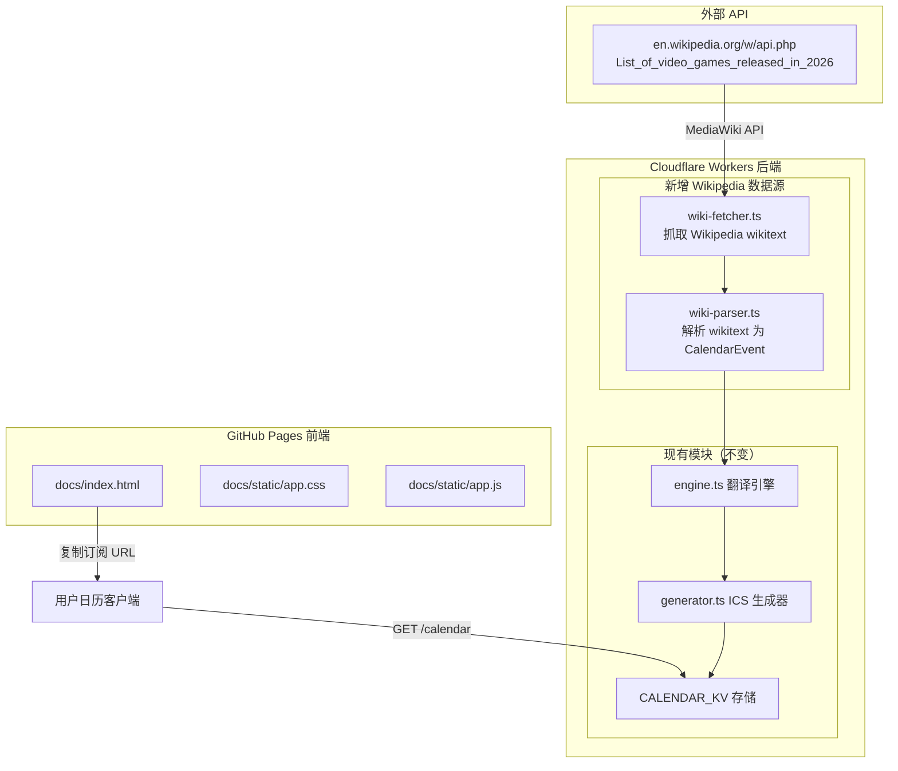

# 实施计划：前端网页 + Wikipedia 数据源

## 目标

1. 创建类似 `ical-videogames.onrender.com` 的前端网页，部署到 GitHub Pages
2. 将数据源从测试占位替换为 Wikipedia 游戏发售日数据

---

## 架构概览



---

## 任务清单

### 第一部分：前端网页（GitHub Pages）

#### T1: 创建前端页面文件结构

在 `docs/` 目录下创建以下文件：

```
docs/
├── index.html          ← 主页面
├── static/
│   ├── app.css         ← 样式
│   └── app.js          ← 交互逻辑
```

#### T2: 实现 `docs/index.html`

参考 `ical-videogames.onrender.com` 的设计，创建中文版页面：

- **平台筛选**：复选框多选
  - PS5、PS4、Nintendo Switch、Xbox Series X|S、Xbox One、PC（Steam）
  - 默认全部勾选
- **动态 URL 生成**：根据选择的平台拼接 `/calendar?platform=ps5&platform=switch` 格式的 URL
- **一键复制按钮**：使用原生 Clipboard API（无需外部库）
- **源码链接**：链接到 GitHub 仓库
- **订阅说明**：简要说明如何在 Apple Calendar / Google Calendar 中订阅

技术要点：
- 纯 HTML + CSS + 原生 JS，无框架
- 响应式设计（`<meta name="viewport">`）
- CSS 变量管理主题色
- Worker 域名硬编码为 `https://game-calendar-cn.<subdomain>.workers.dev`（待确认实际域名）

#### T3: 实现 `docs/static/app.css`

- 浅蓝色背景（`#E6EEFF`）
- 白色卡片居中布局（`max-width: 600px`）
- 卡片阴影效果
- 平台复选框水平排列 + 自动换行
- 移动端适配（`@media` 查询）
- CSS 变量：`--primary-color: rgb(75, 127, 238)`

#### T4: 实现 `docs/static/app.js`

核心逻辑（约 30 行）：
- 监听表单 `change` 事件
- 从复选框提取选中的平台列表
- 拼接 `{host}/calendar?platform=ps5&platform=switch` 格式 URL
- 填入只读输入框
- 复制按钮点击事件（Clipboard API）

---

### 第二部分：Wikipedia 数据源

#### T5: 新增 `src/calendar/wiki-fetcher.ts`

从 Wikipedia MediaWiki API 获取游戏发售日 wikitext。

**API 调用流程**：
1. 获取页面分区列表：`action=parse&page=List_of_video_games_released_in_2026&prop=sections`
2. 逐月获取 wikitext：`action=parse&page=...&prop=wikitext&section={N}`
3. 解析返回的 wikitext 内容

**关键实现**：
- 使用已有的 `WIKIPEDIA_API_ENDPOINT`（`https://en.wikipedia.org/w/api.php`）
- 使用已有的 `WIKIPEDIA_USER_AGENT` 环境变量
- 超时控制：15 秒
- 错误处理：`Promise.allSettled` 容错

**导出函数**：
```typescript
export async function fetchWikipediaGameReleases(year: number): Promise<string[]>
// 返回各月份的 wikitext 内容数组
```

#### T6: 新增 `src/calendar/wiki-parser.ts`

解析 Wikipedia wikitext 为 `CalendarEvent[]`。

**wikitext 格式分析**：
```wiketext
|-
| {{dts|January 5}}
| ''[[Game Title]]''
| WIN, PS5, NS
| ...
```

**解析逻辑**：
1. 按行分割，过滤表格行（以 `|-` 开头）
2. 提取日期：正则匹配 `{{dts|Month Day}}` → 转换为 `YYYYMMDD` 格式
3. 提取游戏名：正则匹配 `''[[Title]]''` 或 `[[Title|Display]]`
4. 提取平台：匹配 `WIN`、`PS5`、`PS4`、`NS`、`XBX`、`XBO` 等标识
5. 生成 UID：`wiki-{year}-{month}-{day}-{sanitized_name}@game-calendar-cn`

**平台映射**：
| Wikipedia 标识 | 项目平台标识 |
|---------------|-------------|
| WIN | pc |
| PS5 | ps5 |
| PS4 | ps4 |
| NS | switch |
| XBX | xbox_series |
| XBO | xbox_one |

**导出函数**：
```typescript
export function parseWikitextToEvents(wikitext: string, year: number): CalendarEvent[]
```

#### T7: 更新 `src/calendar/sources.ts`

将数据源从 iCloud 测试日历替换为 Wikipedia 配置：

```typescript
export interface WikipediaSourceConfig {
  type: 'wikipedia';
  year: number;
  pageTitle: string;  // e.g., "List_of_video_games_released_in_2026"
}

export const CALENDAR_SOURCES: (CalendarSource | WikipediaSourceConfig)[] = [
  {
    type: 'wikipedia',
    year: 2026,
    pageTitle: 'List_of_video_games_released_in_2026',
  },
];
```

注意：保留 `CalendarSource` 接口兼容性，新增 `WikipediaSourceConfig` 类型。

#### T8: 更新 `src/types.ts`

新增 Wikipedia 数据源类型：

```typescript
export interface WikipediaSourceConfig {
  type: 'wikipedia';
  year: number;
  pageTitle: string;
}

export type DataSource = CalendarSource | WikipediaSourceConfig;
```

#### T9: 更新 `src/tasks/update-calendar.ts`

整合 Wikipedia 数据源到现有流程：

```
现有流程：fetchIcsSource → parseIcs → translate → generateIcs
新流程：  fetchWikipediaGameReleases → parseWikitextToEvents → translate → generateIcs
```

修改要点：
- 导入新的 wiki-fetcher 和 wiki-parser
- 在步骤 1-2 中判断数据源类型，分别处理 .ics 和 Wikipedia 两种来源
- Wikipedia 源的事件按平台分组存入 `platformEvents` Map
- 其余流程（翻译、生成 ICS）保持不变

---

### 第三部分：项目配置

#### T10: 添加 `.gitignore`

```gitignore
node_modules/
.tmp/
.wrangler/
.dev.vars
.DS_Store
*.log
```

#### T11: 更新 GitHub Pages 配置

在 GitHub 仓库设置中：
- Source: Deploy from a branch
- Branch: `main` / `/docs`
- 或使用 GitHub Actions 部署

#### T12: 更新 `README.md`

- 更新项目描述
- 添加前端页面链接
- 添加数据源说明（Wikipedia API）
- 更新订阅方式说明
- 添加开发指南

---

## 文件变更汇总

| 操作 | 文件 | 说明 |
|------|------|------|
| 新增 | `docs/index.html` | 前端主页面 |
| 新增 | `docs/static/app.css` | 前端样式 |
| 新增 | `docs/static/app.js` | 前端交互逻辑 |
| 新增 | `src/calendar/wiki-fetcher.ts` | Wikipedia 数据抓取器 |
| 新增 | `src/calendar/wiki-parser.ts` | Wikipedia wikitext 解析器 |
| 新增 | `.gitignore` | Git 忽略配置 |
| 修改 | `src/types.ts` | 新增 WikipediaSourceConfig 类型 |
| 修改 | `src/calendar/sources.ts` | 替换为 Wikipedia 数据源配置 |
| 修改 | `src/tasks/update-calendar.ts` | 整合 Wikipedia 数据源流程 |
| 修改 | `README.md` | 更新项目文档 |

---

## 技术决策

| 决策 | 选择 | 理由 |
|------|------|------|
| 前端框架 | 无框架（纯 HTML/CSS/JS） | 交互逻辑极少，无需框架；与原站一致 |
| 前端部署 | GitHub Pages /docs | 免费、简单、与代码仓库同源 |
| 数据源 | Wikipedia MediaWiki API | 免费、无需认证、数据质量高、结构化 |
| 剪贴板复制 | 原生 Clipboard API | 现代浏览器均支持，无需外部库 |
| CSS 方案 | 手写 CSS + CSS 变量 | 简洁、无构建步骤 |

---

## 风险与注意事项

1. **Wikipedia 页面结构变更**：wikitext 格式可能随编辑者修改而变化，解析器需要容错
2. **Wikipedia API 速率限制**：MediaWiki API 有请求频率限制，需控制并发
3. **前端 Worker 域名**：需要确认实际的 Workers 域名后硬编码到前端页面
4. **GitHub Pages 与 Workers 分离**：前端在 GitHub Pages，API 在 Workers，需确保 CORS 配置正确（日历订阅场景下用户只需复制 URL，不涉及跨域请求）
5. **年份自动切换**：每年需要更新 Wikipedia 页面标题（如 2026 → 2027），可考虑自动推断当前年份
